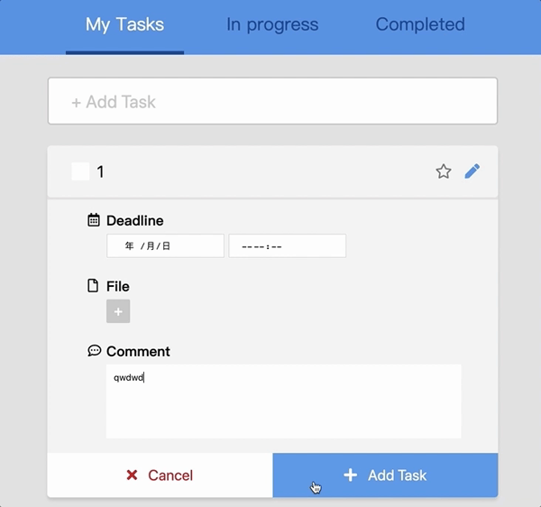

# to-do-list
實作 Vanilla JS / jQuery / Vue.js 三種版本的 TodoList，目的為瞭解事件驅動與資料驅動，其中 Vanilla JS 與 jQuery 版本採用 MVC 架構分離畫面邏輯與資料邏輯。

## Demo
[Vanilla JS](https://yachen168.github.io/TodoList/Vanilla-JS) | [Vue.js](https://yachen168.github.io/TodoList/Vue.js) | [jQuery](https://yachen168.github.io/TodoList/jQuery)

## 功能實現
- 新增任務
- 編輯任務
- 刪除任務
- 任務提示：有無設定 deadline 或註解，若有則在任務下方顯示 icon 提示
- 分類任務，可以切換查看三種狀態：所有任務 / 未完成任務 / 已完成任務
- 點擊星星，可以標記(highlight)任務，該任務將置頂
- 勾選 checkbox，表示任務已完成，該任務將置底
- 即時計算剩餘 / 已完成任務總數

## 學習重點紀錄
- 瞭解事件驅動與資料驅動
- 使用 MVC 架構拆分畫面邏輯、資料邏輯
- ES6 語法
- DOM 操作 (Vanilla JS、jQuery 版本)
- 模組化

 

[設計稿](https://hexschool.github.io/THE_F2E_Design/todolist/)

